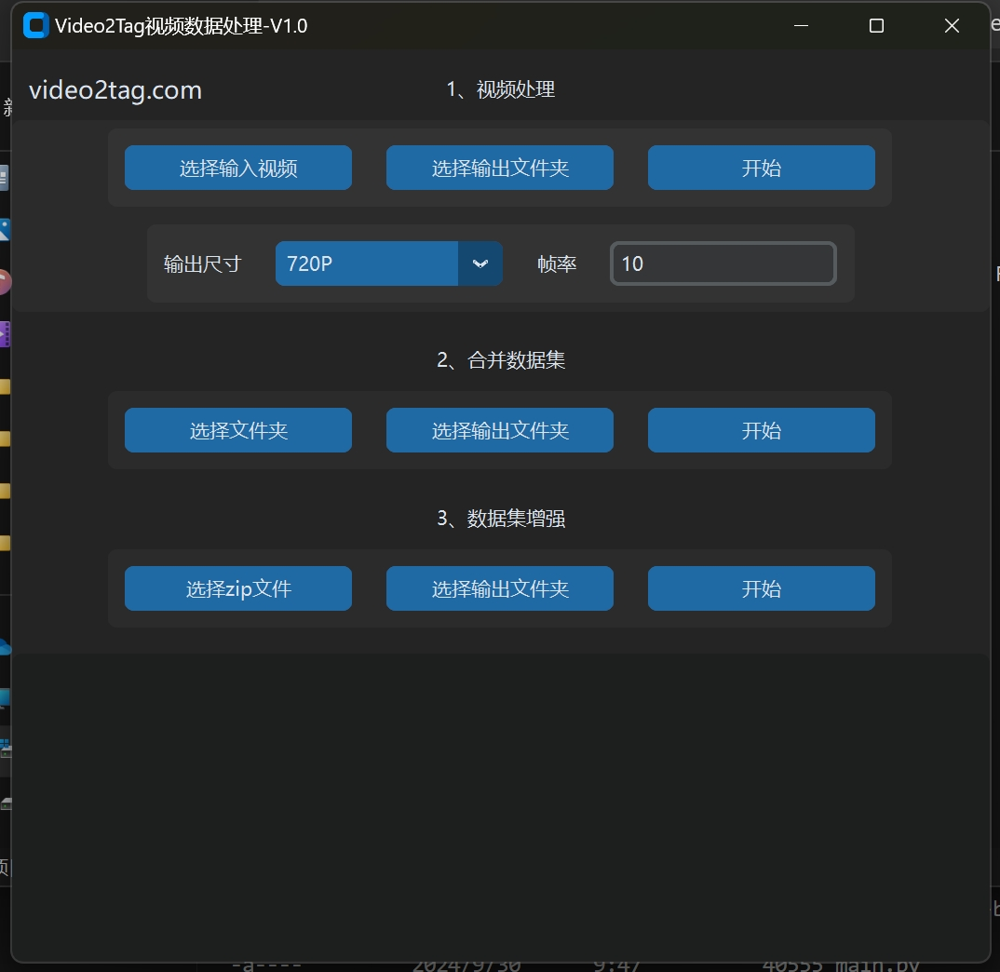

# Video2Tag视频数据集处理



## 简介

- 视频分辨率格式化，抽帧；
- 合并VOC数据集；
- 数据集增强；

## 安装说明

### 使用 Conda 创建和安装环境

1. 克隆本项目到本地：
   ```bash
   git clone https://github.com/lintheyoung/VideoDatasetProcess
   cd VideoDatasetProcess
   ```

2. 使用 conda 创建一个新的环境：
   ```bash
   conda create --name video2tag python=3.9
   ```

   其中，`video2tag` 为你创建的新环境名称。

3. 激活环境：
   ```bash
   conda activate video2tag
   ```

4. 安装项目所需的依赖库：
   ```bash
   pip install -r requirements.txt
   ```

## 运行软件

确保你已经完成了上述环境的安装和依赖的配置后，你可以通过以下命令启动软件：

```bash
python main.py
```

## 打包软件

如果你想将项目打包成一个可执行文件，使用 Nuitka。可以通过以下命令进行打包：

```bash
nuitka --onefile --windows-icon-from-ico=logo.ico --plugin-enable=tk-inter --standalone --windows-disable-console main.py
```

这将创建一个独立的可执行文件，不需要安装 Python 环境即可运行。

## 贡献

非常欢迎社区的贡献！你可以通过以下方式参与项目：

1. 提交 bug 或者功能需求
2. 提交 pull request 改进代码
3. 帮助改进文档

### 如何贡献代码

1. Fork 本仓库
2. 创建一个新的分支 (`git checkout -b feature-xxxx`)
3. 提交修改 (`git commit -m 'Add some feature'`)
4. 推送到远程分支 (`git push origin feature-xxxx`)
5. 创建一个 Pull Request

## 许可证

本项目采用 MIT 许可证。详情请参见 [LICENSE](./LICENSE) 文件。